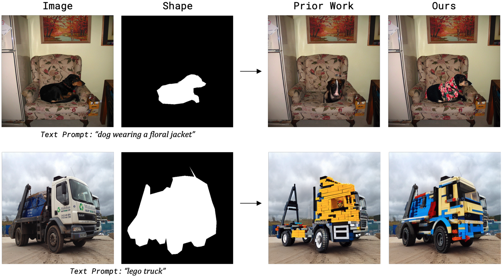

# Shape-Guided Diffusion with Inside-Outside Attention
This repository contains the code and data accompanying the paper [Shape-Guided Diffusion with Inside-Outside Attention](shape-guided-diffusion.github.io). The code implements Shape-Guided Diffusion, a training-free method which produces shape-faithful, text-aligned, realistic objects, by using a novel Inside-Outside Attention mechanism to align the generated content with the target silhouette.


### [Project Page](https://shape-guided-diffusion.github.io/)

## Setup
This code was tested with Python 3.8, Pytorch 1.12 using a pretrained [Stable Diffusion](https://huggingface.co/runwayml/stable-diffusion-v1-5) from [Hugging Face / Diffusers](https://huggingface.co/docs/diffusers/index). To install the additional required packages, please refer to `requirements.txt`.

## Getting Started
To get started, we recommend running the notebook: [**shape-guided-diffusion**](shape_guided_diffusion.ipynb). The notebook contains examples of using our method for diverse applications including mask-based inside editing, outside editing, or both. 

## MS-COCO ShapePrompts
We also provide our MS-COCO ShapePrompts benchmark in the same json format as MS-COCO 2017 instance segmentations (i.e. object masks). Each json file contains a subset of the MS-COCO source file where the object area is between [2%, 50%] of the image area. For overall statistics, please refer to the table below:

| File Name                         | MS-COCO Source File       | Number of Annotations |
| --------------------------------- | ------------------------- | --------------------- |
| mscoco_shape_prompts/val.json     | instances_train2017.json  | 1,000                 |
| mscoco_shape_prompts/test.json    | instances_val2017.json    | 1,149                 |

The json files are structured as follows:
- **images**
- **categories**
- **annotations**
    - **segmentation**: Segmentation / object mask in RLE format.
    - **area**: Area of the object.
    - **iscrowd**: Binary indicator whether the instance is a crowd.
    - **image_id**: ID of the source image that corresponds to an `id` in `images`.
    - **bbox**: Coordinates of the bounding box of the object.
    - **category_id**: ID of the object class that corresponds to an `id` in `categories`, where the string name of the object class corresponds to the source prompt.
    - **id**: ID of the annotation / object.
    - **text**: A prompt describing an edit to the object, corresponding to the edit prompt.

The keys contained in the json files are identical to those in the source values, except for the added `text` field in the `annotations` list. As such these files can be used with standard MS-COCO dataloaders. To convert `segmentation` in RLE format into a standard mask, you can use the following code:

```
from pycocotools import mask
from PIL import Image

def get_segm(instances, idx):
  ann = instances["annotations"][idx]
  segm = ann["segmentation"]
  
  image_id_mapping = {image["id"]: image for image in instances["images"]}
  image_meta = image_id_mapping[ann["image_id"]]
  h, w = image_meta["height"], image_meta["width"]

  rles = mask.frPyObjects(segm, h, w)
  if type(rles) is dict:
      rles = [rles]
  rle = mask.merge(rles)
  segm = mask.decode(rle)
  segm = segm * 255
  segm = Image.fromarray(segm)
  return segm
```

## Citing
```
@article{park2022shape,
  author    = {Park, Dong Huk and Luo, Grace and Toste, Clayton and Azadi, Samaneh and Liu, Xihui and Karalashvili, Maka and Rohrbach, Anna and Darrell, Trevor},
  title     = {Shape-Guided Diffusion with Inside-Outside Attention},
  journal   = {arXiv},
  year      = {2022},
}
```
